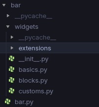
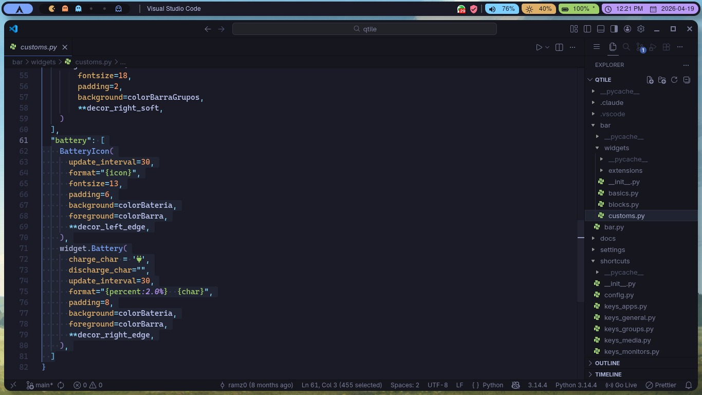
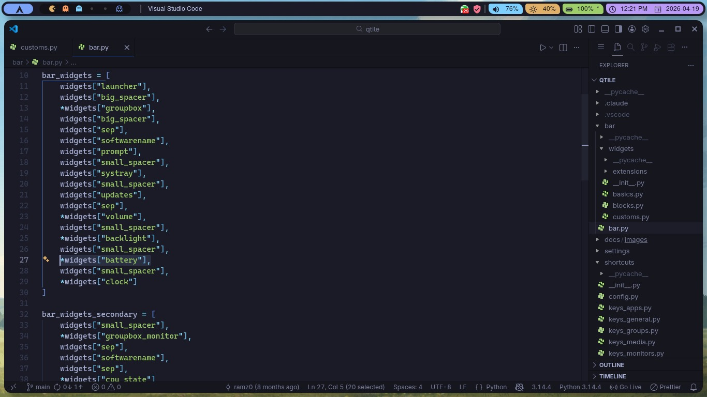
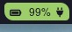
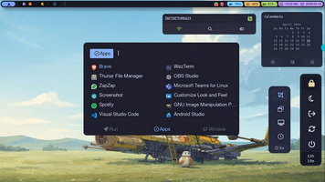

# qtile-ramz

<p align="center">

</p>

Configuración personalizada de Qtile con Qtile Extras.

## Estructura del Proyecto

```
qtile/
├── config.py              # Punto de entrada - importa y combina todo
├── settings/
│   ├── layouts.py         # Configuración de layouts (MonadTall, Max)
│   └── groups.py          # Definición de 6 grupos de trabajo
├── theme/
│   ├── colors.py          # Paleta de colores (cargada desde JSON)
│   ├── decorations.py     # Estilos decorativos (RectDecoration)
│   └── icons.py           # Iconos para los grupos
├── shortcuts/
│   ├── __init__.py        # Combina todos los atajos de teclado
│   ├── config.py          # Configuración base (mod, terminal)
│   ├── keys_general.py    # Navegación de layouts y control de ventanas
│   ├── keys_groups.py     # Cambiar/mover ventanas entre grupos
│   ├── keys_apps.py       # Atajos de aplicaciones
│   ├── keys_media.py      # Volumen, brillo y teclas multimedia
│   ├── keys_rofi.py       # Menú Rofi y powermenu
│   ├── keys_monitors.py   # Control de monitores
│   └── mouse.py           # Acciones de arrastre y clic del ratón
└── bar/
    ├── bar.py             # Configuración de pantalla y barra
    └── widgets/
        ├── __init__.py    # Combina basic + custom + blocks
        ├── basics.py      # Widgets básicos (launcher, systray, updates, etc.)
        ├── customs.py     # Widgets personalizados (WindowName, GroupBox, Battery)
        ├── blocks.py      # Espaciadores y separadores
        └── extensions/    # Widgets personalizados (GroupBox, WindowName, Battery)
```

## Cómo Agregar Widgets

Esta configuración sigue un flujo modular para agregar widgets a la barra. El proceso tiene 3 niveles:

### Flujo de Agregar Widgets

```
1. Documentación → 2. basics/blocks/customs.py → 3. bar/bar.py
```

### Niveles de Widgets

| Nivel | Archivo | Descripción | Cuándo usarlo |
|-------|---------|-------------|---------------|
| **Básico** | `bar/widgets/basics.py` | Widgets simples de libqtile/qtile_extras | Para widgets sin modificar |
| **Blocks** | `bar/widgets/blocks.py` | Espaciadores y separadores | Para espacio entre widgets |
| **Custom** | `bar/widgets/customs.py` | Widgets personalizados | Para widgets con modificaciones o extensiones |



*Estructura de archivos: basics.py, blocks.py, customs.py y extensions/*

### Widgets Personalizados (Extensions)

Algunos widgets en `customs.py` usan extensiones personalizadas en `bar/widgets/extensions/`:

- `BatteryIcon` - Icono de batería con iconos dinámicos
- `MinimalistWindowName` - Nombre de janela minimalista
- `GroupBox` - Grupo de workspaces personalizado

Estos se importan y se usan igual que los widgets normales.

### Paso 1: Elegir widget de la documentación

- [Qtile Widgets](https://docs.qtile.org/en/stable/manual/ref/widgets.html) - Widgets oficiales
- [Qtile Extras](https://qtile-extras.readthedocs.io/) - Widgets adicionales con más funciones

### Paso 2: Agregar al archivo correspondiente

#### Opción A: Widget básico (basics.py)

```python
# Importar
from libqtile import widget
from qtile_extras import widget

# Agregar al diccionario
widgets = {
    "nombre_widget": widget.NombreDelWidget(
        # parámetros...
    ),
}
```

#### Opción B: Bloque/espaciador (blocks.py)

```python
blocks = {
    "mi_spacer": widget.Spacer(length=10),
    "mi_sep": widget.Sep(padding=5),
}
```

#### Opción C: Widget personalizado (customs.py)

```python
# Importar extensión personalizada
from bar.widgets.extensions.mi_widget import MiWidget

widgets = {
    "mi_widget": MiWidget(
        # parámetros...
    ),
}
```

### Paso 3: Decoraciones (opcional)

Los widgets pueden tener bordes redondeados usando `theme/decorations.py`:

```python
# Importar decoraciones
from theme.colors import *
from theme.decorations import *

# Aplicar a un widget
widget.MiWidget(
    background=colorMiColor,
    foreground=colorBarra,
    **decor_left_edge,  # Borde redondeado izquierda
),
```

Decoraciones disponibles:
- `decor_widget_round` - Completamente redondeado
- `decor_left_edge` - Redondeado solo izquierda
- `decor_right_edge` - Redondeado solo derecha
- `decor_left_soft` - Redondeado suave izquierda
- `decor_right_soft` - Redondeado suave derecha

### Paso 4: Agregar a la barra

En `bar/bar.py`, agrega el widget a la lista:

```python
bar_widgets = [
    widgets["launcher"],
    widgets["mi_nuevo_widget"],  # ← Agregar aquí
    widgets["clock"],
]
```

Si es una lista de widgets (múltiples partes):

```python
bar_widgets = [
    *widgets["mi_widget_compuesto"],  # ← Con asterisco para listas
    widgets["clock"],
]
```

### Ejemplo Completo: Agregar widget de Battery

Tomemos como ejemplo el widget **Battery** de la documentación oficial de Qtile:

1. **Buscar en docs**: [Qtile Battery Widget](https://docs.qtile.org/en/stable/manual/ref/widgets.html#libqtile.widget.Battery)

Parámetros principales del widget:
```python
widget.Battery(
    background="color",      # Color de fondo
    foreground="color",      # Color del texto
    battery=0,               # Número de batería (0, 1, etc.)
    charge_char='^',        # Carácter cargando
    discharge_char='V',     # Carácter descargando
    empty_char='x',         # Carácter vacío
    full_char='=',          # Carácter lleno
    format='{char} {percent:2.0%}',  # Formato de texto
    update_interval=60,     # Segundos entre actualizaciones
)
```

2. **Agregar en customs.py** (versión con extensión personalizada):

```python
from libqtile import widget
from qtile_extras import widget
from libqtile.lazy import lazy

from bar.widgets.extensions.battery import BatteryIcon

# Decoraciones
from theme.colors import *
from theme.decorations import *

widgets = {
  "battery": [
    BatteryIcon(
      update_interval=30,
      format="{icon}",
      fontsize=13,
      padding=6,
      background=colorBateria,
      foreground=colorBarra,
      **decor_left_edge,
    ),
    widget.Battery(
      charge_char = '',
      discharge_char="",
      update_interval=30,
      format="{percent:2.0%}  {char}",
      padding=8,
      background=colorBateria,
      foreground=colorBarra,
      **decor_right_edge,
    ),
  ]
}
```

<p align="center">

</p>

*El mismo flujo aplica para basics.py*

3. **Agregar a bar/bar.py**:

```python
bar_widgets = [
    widgets["launcher"],
    widgets["big_spacer"],
    *widgets["groupbox"],
    # ...
    *widgets["battery"],  # ← El asterisco * es obligatorio porque es una lista de múltiples widgets
    widgets["small_spacer"],
    *widgets["clock"]
]
```

<p align="center">

</p>

*Barra principal (bar_widgets). Mismo flujo para barra secundaria (bar_widgets_secondary)*

**¿Por qué el asterisco `*`?**
- `*widgets["battery"]` = Es una **lista** de múltiples widgets (icono + texto)
- `widgets["launcher"]` = Es un **widget único** (sin asterisco)

4. **Reiniciar Qtile**: `Mod + Ctrl + r`



*Resultado: Widget de batería con icono personalizado, colores y decoraciones redondeadas*

---

### Personalizar un Widget (Custom/Extensions)

Si necesitas modificar el comportamiento de un widget, puedes crear una extensión:

```python
# bar/widgets/extensions/mi_widget.py
from libqtile.widget import Battery as _Battery

class MiBattery(_Battery):
    def __init__(self, **config):
        super().__init__(**config)
        # Personalizar lógica aquí
```

Luego lo importas en `customs.py`:
```python
from bar.widgets.extensions.mi_widget import MiBattery

widgets = {
    "mi_battery": MiBattery(...),
}
```

## La Tecla Mod

 = Mod

La tecla **Windows** de tu teclado (también llamada **Super** en Linux/Mac).

## Catálogo de Atajos

<details>
<summary><b>🧭 General - Navegación y Control</b></summary>

| Atajo | Acción |
|-------|--------|
| `Mod + Space` | Alternar ventana flotante |
| `Mod + Enter` | Abrir terminal |
| `Mod + Tab` | Siguiente layout |
| `Mod + w` | Cerrar ventana |
| `Mod + n` | Normalizar tamaño de ventanas |
| `Mod + Shift + Return` | Alternar split en MonadTall |
| `Mod + Ctrl + r` | Reiniciar Qtile |
| `Mod + Ctrl + q` | Salir de Qtile |

##### Movimiento entre ventanas
| Atajo | Acción |
|-------|--------|
| `Mod + ←/→/↑/↓` | Moverse entre ventanas |
| `Mod + Shift + ←/→/↑/↓` | Mover ventana |
| `Mod + Ctrl + ←/→/↑/↓` | Redimensionar ventana |

</details>

<details>
<summary><b>Grupos de Trabajo</b></summary>

| Atajo | Acción |
|-------|--------|
| `Mod + [1-6]` | Cambiar al grupo |
| `Mod + Shift + [1-6]` | Mover ventana al grupo |

Soporta workspaces pareados para múltiples monitores (ej: 1 y 1b, 2 y 2b, etc.). Al presionar nuevamente se vuelve al grupo anterior.

</details>

<details>
<summary><b>🖥️ Monitores</b></summary>

| Atajo | Acción |
|-------|--------|
| `Mod + m` | Toggle HDMI externo (conecta/desconecta) |
| `Mod + b` | Mostrar/ocultar barra de laptop |
| `Mod + Shift + b` | Mostrar/ocultar barra del monitor |

</details>

<details>
<summary><b>📱 Multimedia (Volumen y Brillo)</b></summary>

##### Volumen
| Atajo | Acción |
|-------|--------|
| `XF86AudioMute` | Silenciar/restaurar volumen |
| `XF86AudioLowerVolume` | Bajar volumen |
| `XF86AudioRaiseVolume` | Subir volumen |

##### Brillo
| Atajo | Acción |
|-------|--------|
| `Mod + i` | Aumentar brillo (+5%) |
| `Mod + k` | Disminuir brillo (-5%) |

##### Reproducción
| Atajo | Acción |
|-------|--------|
| `XF86AudioPlay` | Play/Pausa |
| `XF86AudioNext` | Siguiente pista |
| `XF86AudioPrev` | Pista anterior |

</details>

<details>
<summary><b>🚀 Aplicaciones</b></summary>

| Atajo | Acción |
|-------|--------|
| `Mod + r` | Menú de aplicaciones (Rofi) |
| `Mod + Alt + Tab` | Selector de ventanas (Rofi) |
| `Mod + e` | Selector de emoji (Rofi) |
| `Mod + p` | Menú de apagado (powermenu) |
| `Mod + Shift + n` | WiFi (conectar/desconectar) |
| `Mod + d` | Calendario |
| `Mod + Ctrl + Shift + s` | Captura de pantalla |
| `Mod + c` | Visual Studio Code |

</details>

<details>
<summary><b>🖱️ Ratón</b></summary>

| Atajo | Acción |
|-------|--------|
| `Mod + Click 1` | Arrastrar ventana (posición) |
| `Mod + Click 3` | Arrastrar ventana (tamaño) |
| `Mod + Click 2` | Traer ventana al frente |

</details>

## Paleta de Colores

La paleta se carga desde un archivo JSON en `theme/colors/`. Esto permite cambiar completamente el aspecto visual sin modificar código Python.

### Paletas disponibles

- `tokyo-night-moon.json` - Oscuro con tonos lavados pasteles
- `tokyo-night-storm.json` - Oscuro clásico (por defecto)
- `tokyo-night-night.json` - Oscuro profundo
- `tokyo-night-day.json` - Versión clara

### Cómo cambiar de paleta

Edita `theme/colors.py` y cambia la variable:

```python
PALETTE_FILE = "tokyo-night-storm.json"  # Cambia aquí
```

### Cómo crear tu propia paleta

Crea un archivo JSON en `theme/colors/` con el siguiente formato:

```json
{
  "name": "Mi Tema Personal",
  "author": "Tu Nombre",
  "colors": {
    "base": "#1e1e2e",
    "mantle": "#181825",
    "crust": "#11111b",
    "text": "#cdd6f4",
    "subtext1": "#bac2de",
    "subtext0": "#a6adc8",
    "overlay2": "#9399b2",
    "overlay1": "#7f849c",
    "overlay0": "#6c7086",
    "surface2": "#585b70",
    "surface1": "#45475a",
    "surface0": "#313244",
    "base0": "#45475a",
    "lavender": "#89b4fa",
    "blue": "#89b4fa",
    "sapphire": "#74a7ff",
    "sky": "#89dced",
    "teal": "#94e2d5",
    "green": "#a6e3a1",
    "yellow": "#f9e2af",
    "peach": "#f5a97f",
    "maroon": "#eba0ac",
    "red": "#f38ba8",
    "mauve": "#cba6f7",
    "pink": "#f5c2e7",
    "flamingo": "#f2cdcd",
    "rosewater": "#f5e0dc"
  }
}
```

Luego importa este archivo en `theme/colors.py` cambiando `PALETTE_FILE`.

### Dónde descargar más paletas

- [tokyo-night.nvim](https://github.com/folke/tokyo-night.nvim) - Repo oficial de Tokyo Night
- [catppuccin](https://github.com/catppuccin/catppuccin) - Temas para muchas apps
- [dracula](https://github.com/dracula/dracula-theme) - Tema clásico oscuro
- [nord](https://github.com/nordtheme/nord) - Tema ártico, norte
- [github themes](https://github.com/topics/color-scheme) - Busca "color scheme json"

## Requisitos

### Paquetes esenciales

| Paquete | Descripción | Arch (pacman) | AUR (yay) |
|---------|-------------|---------------|-----------|
| `qtile` | Gestor de ventanas | `qtile` | `qtile-git` |
| `python-pyqtl` | bindings Python (ya incluido) | - | - |
| `python-xkbgroup` | Soporte para teclas avanzadas | `python-xkbgroup` | - |
| `qtile-extras` | Widgets y funciones adicionales | `python-qtile-extras` | `qtile-extras-git` |
| `rofi` | Menú de aplicaciones | `rofi` | `rofi-power-menu` |
| `picom` | Compositor (transparencias) | `picom` | `picom-git` |

### Herramientas multimedia (volumen, brillo, reproductor)

| Paquete | Descripción | Arch (pacman) | AUR (yay) |
|---------|-------------|---------------|-----------|
| `pamixer` | Control de volumen | `pamixer` | - |
| `brightnessctl` | Control de brillo | `brightnessctl` | - |
| `playerctl` | Control de reproductor | `playerctl` | - |

### Iconos y fuentes

| Paquete | Descripción | Arch (pacman) | AUR (yay) |
|---------|-------------|---------------|-----------|
| `papirus-icon-theme` | Iconos | `papirus-icon-theme` | - |
| `ttf-jetbrains-mono` | Fuente monoespaciada | `ttf-jetbrains-mono` | `jetbrains-mono` |
| `ttf-jetbrains-mono-nerd` | Nerd Fonts variant | - | `ttf-jetbrains-mono-nerd` |

#### Fuentes Nerd Fonts alternativas populares

```bash
# Descarga directa de https://www.nerdfonts.com/font-downloads
# O instala desde AUR:
yay -S ttf-jetbrains-mono-nerd ttf-fira-code-nerd ttf-hack ttf-cascadia-code
```

### Dependencias de sistema (通常 ya instaladas)

| Paquete | Descripción |
|---------|------------|
| `networkmanager` | WiFi (usado por scripts WiFi) |
| ` NetworkManager-applet` | UI para WiFi |
| `discord` | Notificaciones (dunst) |
| `xorg-xrandr` | Control de monitores |

## Instalación

### 1. Instalar dependencias

```bash
# Arch Linux (core)
sudo pacman -S qtile python-xkbgroup rofi picom pamixer brightnessctl playerctl papirus-icon-theme ttf-jetbrains-mono

# AUR (más actualizado)
yay -S qtile-git qtile-extras-git ttf-jetbrains-mono-nerd
```

### 2. Copiar configuración

```bash
cp -r qtile/ ~/.config/
```

### 3. Configuración adicional

#### Rofi Scripts

| Paquete | Descripción |
|---------|-------------|
| [RofiCollection](https://github.com/ramz0/RofiCollection.git) | Scripts para volumen, powermenu, screenshot, wifi, calendario, emoji |



*Ver más scripts en el [repositorio de RofiCollection](https://github.com/ramz0/RofiCollection)*

Clonar el repositorio:

```bash
git clone https://github.com/ramz0/RofiCollection.git ~/.config/rofi
```

Los scripts necesarios están en `~/.config/rofi/bin/`:
- `volume-bar` - Control de volumen con OSD
- `powermenu` - Menú de apagado
- `screenshot` - Captura de pantalla
- `calendar` - Calendario rápido
- `wifi` - Conexiones WiFi
- `emoji` - Selector de emoji

#### Verificar funcionamiento

```bash
# Verificar Qtile
qtile cmd -f eval "group.get_screen_for_group()"

# Probar scripts de rofi
~/.config/rofi/bin/powermenu
```

### 4. Iniciar / Reiniciar

```bash
# Reiniciar Qtile
Mod + Ctrl + r
```

## Solución de problemas

### La barra no aparece
- Verifica que `qtile-extras` esté instalado: `python -c "import qtile_extras"`
- Revisa los logs: `qtile msg -o debug`

### Los atajos de volumen no funcionan
- Verifica pamixer: `pamixer --get-volume`
- Revisa el script: `~/.config/rofi/bin/volume-bar`

### Rofi no muestra iconos
- Instala Papirus: `sudo pacman -S papirus-icon-theme`
- Usa: `rofi -show drun -icon-theme "Papirus" -show-icons`

### Fuentes con símbolos faltantes
- Instala Nerd Fonts: `yay -S ttf-jetbrains-mono-nerd`
- Configura en tu terminal: `font: JetBrainsMonoNerd Font:size=11`

## Recursos adicionales

- [Wiki oficial de Qtile](https://docs.qtile.org/)
- [Qtile Extras](https://qtile-extras.readthedocs.io/)
- [Rofi scripts collection](https://github.com/adi1090x/rofi)
