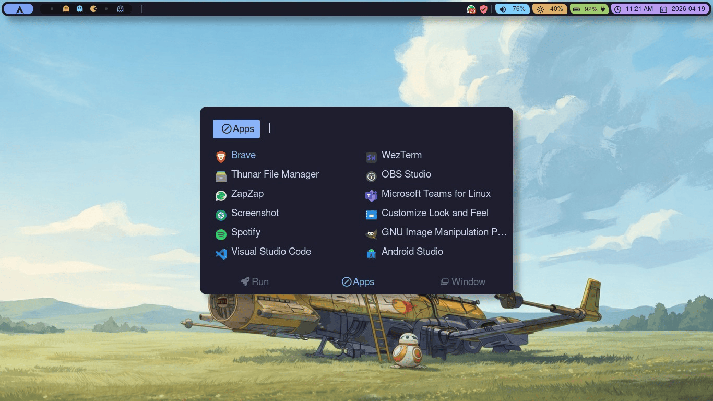
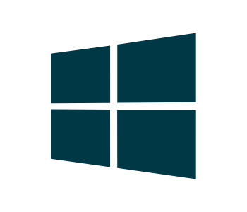

# qtile-ramz



Configuración personalizada de Qtile con Qtile Extras.

## Estructura del Proyecto

```
qtile/
├── config.py              # Punto de entrada - importa y combina todo
├── settings/
│   ├── layouts.py         # Configuración de layouts (MonadTall, Max)
│   └── groups.py          # Definición de 6 grupos de trabajo
├── theme/
│   ├── colors.py          # Paleta de colores (cargada desde JSON)
│   ├── decorations.py     # Estilos decorativos (RectDecoration)
│   └── icons.py           # Iconos para los grupos
├── shortcuts/
│   ├── __init__.py        # Combina todos los atajos de teclado
│   ├── config.py          # Configuración base (mod, terminal)
│   ├── keys_general.py    # Navegación de layouts y control de ventanas
│   ├── keys_groups.py     # Cambiar/mover ventanas entre grupos
│   ├── keys_apps.py       # Atajos de aplicaciones
│   ├── keys_media.py      # Volumen, brillo y teclas multimedia
│   ├── keys_rofi.py       # Menú Rofi y powermenu
│   ├── keys_monitors.py   # Control de monitores
│   └── mouse.py           # Acciones de arrastre y clic del ratón
└── bar/
    ├── bar.py             # Configuración de pantalla y barra
    └── widgets/
        ├── __init__.py    # Combina basic + custom + blocks
        ├── basics.py      # Widgets básicos (launcher, systray, updates, etc.)
        ├── customs.py     # Widgets personalizados (WindowName, GroupBox, Battery)
        ├── blocks.py      # Espaciadores y separadores
        └── extensions/    # Widgets personalizados (GroupBox, WindowName, Battery)
```

## La Tecla Mod

 = Mod

La tecla **Windows** de tu teclado (también llamada **Super** en Linux/Mac).

## Catálogo de Atajos

<details>
<summary><b>�_general - Navegación y Control</b></summary>

| Atajo | Acción |
|-------|--------|
| `Mod + Space` | Alternar ventana flotante |
| `Mod + Enter` | Abrir terminal |
| `Mod + Tab` | Siguiente layout |
| `Mod + w` | Cerrar ventana |
| `Mod + n` | Normalizar tamaño de ventanas |
| `Mod + Shift + Return` | Alternar split en MonadTall |
| `Mod + Ctrl + r` | Reiniciar Qtile |
| `Mod + Ctrl + q` | Salir de Qtile |

##### Movimiento entre ventanas
| Atajo | Acción |
|-------|--------|
| `Mod + ←/→/↑/↓` | Moverse entre ventanas |
| `Mod + Shift + ←/→/↑/↓` | Mover ventana |
| `Mod + Ctrl + ←/→/↑/↓` | Redimensionar ventana |

</details>

<details>
<summary><b>📁 Grupos de Trabajo</b></summary>

| Atajo | Acción |
|-------|--------|
| `Mod + [1-6]` | Cambiar al grupo |
| `Mod + Shift + [1-6]` | Mover ventana al grupo |

Soporta workspaces pareados para múltiples monitores (ej: 1 y 1b, 2 y 2b, etc.). Al presionar nuevamente se vuelve al grupo anterior.

</details>

<details>
<summary><b>🖥️ Monitores</b></summary>

| Atajo | Acción |
|-------|--------|
| `Mod + m` | Toggle HDMI externo (conecta/desconecta) |
| `Mod + b` | Mostrar/ocultar barra de laptop |
| `Mod + Shift + b` | Mostrar/ocultar barra del monitor |

</details>

<details>
<summary><b>📱 multimedia (Volumen y Brillo)</b></summary>

##### Volumen
| Atajo | Acción |
|-------|--------|
| `XF86AudioMute` | Silenciar/restaurar volumen |
| `XF86AudioLowerVolume` | Bajar volumen |
| `XF86AudioRaiseVolume` | Subir volumen |

##### Brillo
| Atajo | Acción |
|-------|--------|
| `Mod + i` | Aumentar brillo (+5%) |
| `Mod + k` | Disminuir brillo (-5%) |

##### Reproducción
| Atajo | Acción |
|-------|--------|
| `XF86AudioPlay` | Play/Pausa |
| `XF86AudioNext` | Siguiente pista |
| `XF86AudioPrev` | Pista anterior |

</details>

<details>
<summary><b>🚀 Aplicaciones</b></summary>

| Atajo | Acción |
|-------|--------|
| `Mod + r` | Menú de aplicaciones (Rofi) |
| `Mod + Alt + Tab` | Selector de ventanas (Rofi) |
| `Mod + e` | Selector de emoji (Rofi) |
| `Mod + p` | Menú de apagado (powermenu) |
| `Mod + Shift + n` | WiFi (conectar/desconectar) |
| `Mod + d` | Calendario |
| `Mod + Ctrl + Shift + s` | Captura de pantalla |
| `Mod + c` | Visual Studio Code |

</details>

<details>
<summary><b>🖱️ Ratón</b></summary>

| Atajo | Acción |
|-------|--------|
| `Mod + Click 1` | Arrastrar ventana (posición) |
| `Mod + Click 3` | Arrastrar ventana (tamaño) |
| `Mod + Click 2` | Traer ventana al frente |

</details>

## Paleta de Colores

La paleta se carga desde un archivo JSON en `theme/colors/`. Esto permite cambiar completamente el aspecto visual sin modificar código Python.

### Paletas disponibles

- `tokyo-night-moon.json` - Oscuro con tonos lavados pasteles
- `tokyo-night-storm.json` - Oscuro clásico (por defecto)
- `tokyo-night-night.json` - Oscuro profundo
- `tokyo-night-day.json` - Versión clara

### Cómo cambiar de paleta

Edita `theme/colors.py` y cambia la variable:

```python
PALETTE_FILE = "tokyo-night-storm.json"  # Cambia aquí
```

### Cómo crear tu propia paleta

Crea un archivo JSON en `theme/colors/` con el siguiente formato:

```json
{
  "name": "Mi Tema Personal",
  "author": "Tu Nombre",
  "colors": {
    "base": "#1e1e2e",
    "mantle": "#181825",
    "crust": "#11111b",
    "text": "#cdd6f4",
    "subtext1": "#bac2de",
    "subtext0": "#a6adc8",
    "overlay2": "#9399b2",
    "overlay1": "#7f849c",
    "overlay0": "#6c7086",
    "surface2": "#585b70",
    "surface1": "#45475a",
    "surface0": "#313244",
    "base0": "#45475a",
    "lavender": "#89b4fa",
    "blue": "#89b4fa",
    "sapphire": "#74a7ff",
    "sky": "#89dced",
    "teal": "#94e2d5",
    "green": "#a6e3a1",
    "yellow": "#f9e2af",
    "peach": "#f5a97f",
    "maroon": "#eba0ac",
    "red": "#f38ba8",
    "mauve": "#cba6f7",
    "pink": "#f5c2e7",
    "flamingo": "#f2cdcd",
    "rosewater": "#f5e0dc"
  }
}
```

Luego importa este archivo en `theme/colors.py` cambiando `PALETTE_FILE`.

### Dónde descargar más paletas

- [tokyo-night.nvim](https://github.com/folke/tokyo-night.nvim) - Repo oficial de Tokyo Night
- [catppuccin](https://github.com/catppuccin/catppuccin) - Temas para muchas apps
- [dracula](https://github.com/dracula/dracula-theme) - Tema clásico oscuro
- [nord](https://github.com/nordtheme/nord) - Tema ártico, norte
- [github themes](https://github.com/topics/color-scheme) - Busca "color scheme json"

## Requisitos

### Paquetes esenciales

| Paquete | Descripción | Arch (pacman) | AUR (yay) |
|---------|-------------|---------------|-----------|
| `qtile` | Gestor de ventanas | `qtile` | `qtile-git` |
| `python-pyqtl` | bindings Python (ya incluido) | - | - |
| `python-xkbgroup` | Soporte para teclas avanzadas | `python-xkbgroup` | - |
| `qtile-extras` | Widgets y funciones adicionales | `python-qtile-extras` | `qtile-extras-git` |
| `rofi` | Menú de aplicaciones | `rofi` | `rofi-power-menu` |
| `picom` | Compositor (transparencias) | `picom` | `picom-git` |

### Herramientas multimedia (volumen, brillo, reproductor)

| Paquete | Descripción | Arch (pacman) | AUR (yay) |
|---------|-------------|---------------|-----------|
| `pamixer` | Control de volumen | `pamixer` | - |
| `brightnessctl` | Control de brillo | `brightnessctl` | - |
| `playerctl` | Control de reproductor | `playerctl` | - |

### Iconos y fuentes

| Paquete | Descripción | Arch (pacman) | AUR (yay) |
|---------|-------------|---------------|-----------|
| `papirus-icon-theme` | Iconos | `papirus-icon-theme` | - |
| `ttf-jetbrains-mono` | Fuente monoespaciada | `ttf-jetbrains-mono` | `jetbrains-mono` |
| `ttf-jetbrains-mono-nerd` | Nerd Fonts variant | - | `ttf-jetbrains-mono-nerd` |

#### Fuentes Nerd Fonts alternativas populares

```bash
# Descarga directa de https://www.nerdfonts.com/font-downloads
# O instala desde AUR:
yay -S ttf-jetbrains-mono-nerd ttf-fira-code-nerd ttf-hack ttf-cascadia-code
```

### Dependencias de sistema (通常 ya instaladas)

| Paquete | Descripción |
|---------|------------|
| `networkmanager` | WiFi (usado por scripts WiFi) |
| ` NetworkManager-applet` | UI para WiFi |
| `discord` | Notificaciones (dunst) |
| `xorg-xrandr` | Control de monitores |

## Instalación

### 1. Instalar dependencias

```bash
# Arch Linux (core)
sudo pacman -S qtile python-xkbgroup rofi picom pamixer brightnessctl playerctl papirus-icon-theme ttf-jetbrains-mono

# AUR (más actualizado)
yay -S qtile-git qtile-extras-git ttf-jetbrains-mono-nerd
```

### 2. Copiar configuración

```bash
cp -r qtile/ ~/.config/
```

### 3. Configuración adicional

#### Rofi Scripts

| Paquete | Descripción |
|---------|-------------|
| [RofiCollection](https://github.com/ramz0/RofiCollection.git) | Scripts para volumen, powermenu, screenshot, wifi, calendario, emoji |

Clonar el repositorio:

```bash
git clone https://github.com/ramz0/RofiCollection.git ~/.config/rofi
```

Los scripts necesarios están en `~/.config/rofi/bin/`:
- `volume-bar` - Control de volumen con OSD
- `powermenu` - Menú de apagado
- `screenshot` - Captura de pantalla
- `calendar` - Calendario rápido
- `wifi` - Conexiones WiFi
- `emoji` - Selector de emoji

#### Verificar funcionamiento

```bash
# Verificar Qtile
qtile cmd -f eval "group.get_screen_for_group()"

# Probar scripts de rofi
~/.config/rofi/bin/powermenu
```

### 4. Iniciar / Reiniciar

```bash
# Reiniciar Qtile
Mod + Ctrl + r
```

## Solución de problemas

### La barra no aparece
- Verifica que `qtile-extras` esté instalado: `python -c "import qtile_extras"`
- Revisa los logs: `qtile msg -o debug`

### Los atajos de volumen no funcionan
- Verifica pamixer: `pamixer --get-volume`
- Revisa el script: `~/.config/rofi/bin/volume-bar`

### Rofi no muestra iconos
- Instala Papirus: `sudo pacman -S papirus-icon-theme`
- Usa: `rofi -show drun -icon-theme "Papirus" -show-icons`

### Fuentes con símbolos faltantes
- Instala Nerd Fonts: `yay -S ttf-jetbrains-mono-nerd`
- Configura en tu terminal: `font: JetBrainsMonoNerd Font:size=11`

## Recursos adicionales

- [Wiki oficial de Qtile](https://docs.qtile.org/)
- [Qtile Extras](https://qtile-extras.readthedocs.io/)
- [Rofi scripts collection](https://github.com/adi1090x/rofi)
- [Awesome Qtile](https://github.com/x4121/awesome-qtile)